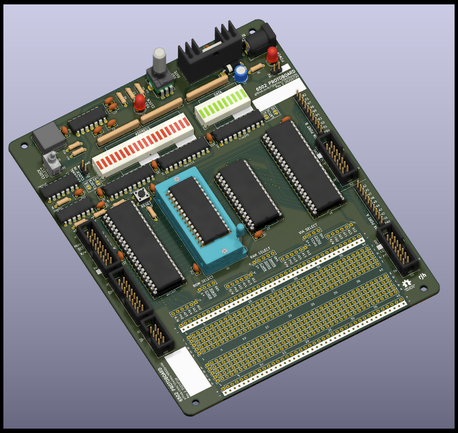
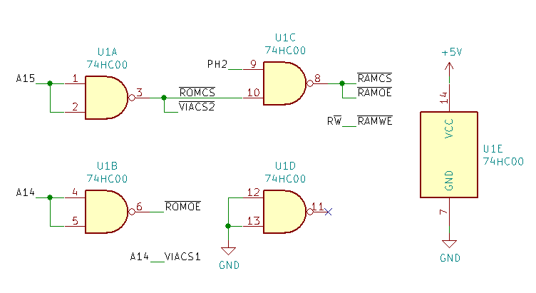
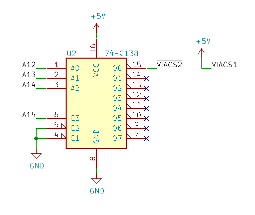

# 6502 Protoboard

A prototyping board for experimenting with 6502 hardware and software design

This board implements a minimal 6502 system, containing a 65C02 processor, a 65C22 Versatile Interface Adapter (VIA), a 32kB EEPROM and 32kB of SRAM.

This project would not have been possible without Garth Wilson's excellent [6502 Primer](https://wilsonminesco.com/6502primer/index.html), which is eseential reading for anyone looking to get started with 6502 homebrew.

## Table of contents

- [Features](#features)
- [Building](#building)
- [Implementing address decoding](#implementing-address-decoding)
  - [Minimal setup](#minimal-setup)
  - [Adding more I/O](#adding-more-i-o)
- [Header pinouts](#header-pinouts)
  - [CPU signals](#cpu-signals)
  - [Address bus](#address-bus)
  - [CPU bus](#cpu-bus)
  - [VIA ports](#via-ports)
- [Useful links](#useful-links)

## Features

- Two clock sources: 1MHz crystal oscillator "fast" clock and 555-timer based "slow" clock (approx 0.5Hz - 500Hz)
- Blinkenlights for the address and data buses
- Header for external clock source, if desired
- 400-point breadboard area, for address decoding and other small circuits
- IDC headers for address & data buses, CPU signals, and both VIA ports

## Building

More to come - for now, refer to the [interactive BOM](https://rjhelms.github.io/6502proto/ibom.html).

## Implementing address decoding

In order to let the 6502 processor talk to other chips, any 6502 system requires some address decoding logic. The board has no address decoding built in; it is up to the builder to implement their chosen address decoding with the breadboard area.

Pads above the breadboard area provide access to the 4 highest bytes of the address bus, as well as the PH2 clock and R/W, and the relevant inputs for each of the on-board ICs.

The [address decoding chapter](https://wilsonminesco.com/6502primer/addr_decoding.html) of Garth Wilson's primer is well worth a read before deciding what to implement.

Some key considerations when choosing an address decoding scheme:

- Each address should select at most one device
- Writes to RAM should only occur when PH2 is high
- RAM should be at the bottom of the address space, to include the  zero  page ($0000-$00FF) and stack ($0100-$01FF).
- ROM should be at the top of the address space, to include the reset and interrupt vectors at $FFFA-$FFFF.

### Minimal setup

For a system only using the RAM, ROM, and VIA chips on board, satisfactory results can be achieved with a single 74HC00 quad NAND gate:

| Start | End   | Device |
|-------|-------|--------|
| $0000 | $7FFF | RAM    |
| $8000 | $BFFF | VIA    |
| $C000 | $FFFF | ROM    |

With only 64kB of address space and 32kB of both RAM and ROM, at least some portion of one of these will need to be masked by the VIA or other devices. This logic masks the lower half of ROM, resulting in a system with 32kB of RAM and 16kB of ROM.

A similar addressing scheme with 16kB of RAM and 32kB of ROM can also be implemented with one 74HC00.

### Adding more I/O

The minimal setup above works just fine for the chips on the protoboard, but doesn't leave any room for expanding the system any further. Also, while the VIA only needs 16 bytes of address space, the above setup allocates a whole 16kB to it!

By using a 74HC138 line decoder, that 16kB can be split into 8 2kB segments, each addressed by one output.

| Start | End   | Device |
|-------|-------|--------|
| $0000 | $7FFF | RAM    |
| $8000 | $87FF | (VIA) '138 output 0 |
...
| $B800 | $BFFF | '138 output 7 |
| $C000 | $FFFF | ROM    |

## Header pinouts

### CPU signals

| Pin | Signal | Pin | Signal |
|-----|--------|-----|--------|
| 1   | PH2    | 2   | PH2    |
| 3   | RESET  | 4   | RDY    |
| 5   | R/W    | 6   | IRQ    |
| 7   | unused | 8   | NMI    |
| 9   | unused | 10  | SYNC   |
| 11  | unused | 12  | BE     |
| 13  | 5V     | 14  | 5V     |
| 15  | GND    | 16  | GND    |

### Address bus

| Pin | Signal | Pin | Signal |
|-----|--------|-----|--------|
| 1   | A0     | 2   | A1     |
| 3   | A2     | 4   | A3     |
| 5   | A4     | 6   | A5     |
| 7   | A6     | 8   | A7     |
| 9   | A8     | 10  | A9     |
| 11  | A10    | 12  | A11    |
| 13  | A12    | 14  | A13    |
| 15  | A14    | 16  | A15    |

### CPU bus

| Pin | Signal | Pin | Signal |
|-----|--------|-----|--------|
| 1   | D0     | 2   | D1     |
| 3   | D2     | 4   | D3     |
| 5   | D4     | 6   | D5     |
| 7   | D6     | 8   | D7     |

### VIA ports

| Pin | Signal | Pin | Signal |
|-----|--------|-----|--------|
| 1   | 5V     | 2   | 5V     |
| 3   | PA0    | 4   | PA1    |
| 5   | PA2    | 6   | PA3    |
| 7   | PA4    | 8   | PA5    |
| 9   | PA6    | 10  | PA7    |
| 11  | CA1    | 12  | CA2    |
| 13  | GND    | 14  | GND    |

## Useful links

- [6502.org](http://6502.org/) - a wealth of information on 6502 hardware and software
- Garth Wilson's [6502 Primer](https://wilsonminesco.com/6502primer/index.html)
- Western Design Center, with datasheets and other useful info
  - [W65C02S 8-bit Microprocessor](https://www.westerndesigncenter.com/wdc/w65c02s-chip.php)
  - [W65C22 Versatile Interface Adapter (VIA)](https://www.westerndesigncenter.com/wdc/w65c22-chip.php)
- [cc65](https://cc65.github.io/), a 6502 C compiler and assembler
